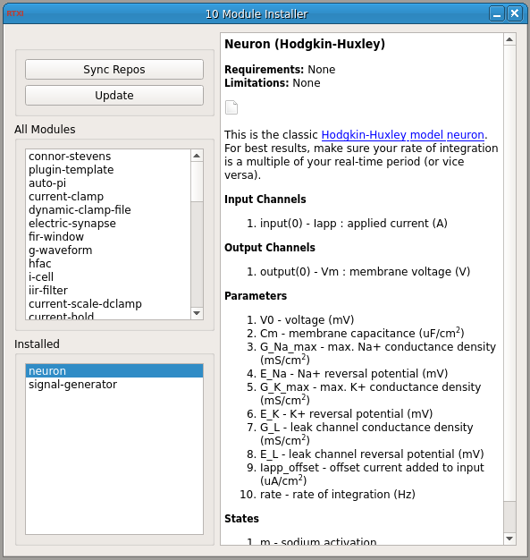

# module-installer

**Requirements:** libgit2-dev, libmarkdown2-dev, -lQt5Network
**Limitations:** currently in alpha

Download and install modules within RTXI. If RTXI is running as root, all modules will be downloaded and installed into `/usr/local/lib/rtxi_modules`, and if not, they will be found in `~/.config/rtxi/`.  

The module can only keep track of modules installed in the above pre-defined directories.  

Known bugs: 

 - READMEs don't get updated after installing/updating a module. 
